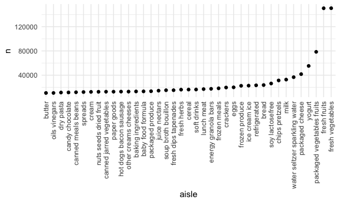
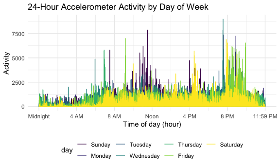
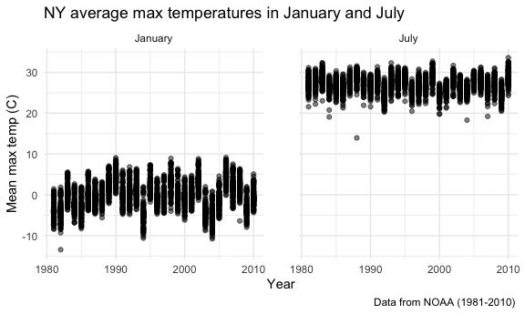
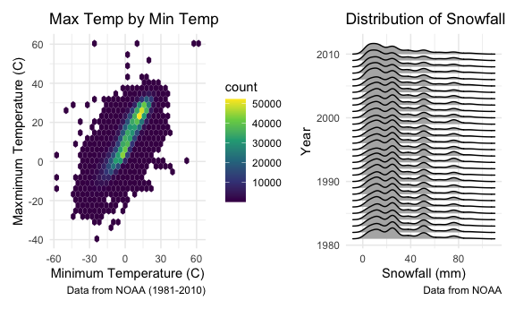

p8105\_hw3\_cl3938
================
Cynthia Liu (cl3938)

``` r
library(tidyverse)
```

    ## ── Attaching packages ────────────────────────────────────────────────────────────────────────────────────────────────────────────────── tidyverse 1.3.0 ──

    ## ✓ ggplot2 3.3.2     ✓ purrr   0.3.4
    ## ✓ tibble  3.0.3     ✓ dplyr   1.0.1
    ## ✓ tidyr   1.1.1     ✓ stringr 1.4.0
    ## ✓ readr   1.3.1     ✓ forcats 0.5.0

    ## ── Conflicts ───────────────────────────────────────────────────────────────────────────────────────────────────────────────────── tidyverse_conflicts() ──
    ## x dplyr::filter() masks stats::filter()
    ## x dplyr::lag()    masks stats::lag()

``` r
library(p8105.datasets)
library(dplyr)
library(ggridges)
library(patchwork)

knitr::opts_chunk$set(
    fig.width = 6, 
  fig.asp = .6,
  out.width = "90%"
)
theme_set(theme_minimal() + theme(legend.position = "bottom"))
options(
  ggplot2.continuous.colour = "viridis",
  ggplot2.continuous.fill = "viridis"
)
scale_colour_discrete = scale_colour_viridis_d
scale_fill_discrete = scale_fill_viridis_d
```

## Problem 1

### Load the data

``` r
data("instacart")
```

This dataset contains 1384617 rows and 15 columns.

Observations are the level of items in orders by user. There are user /
order variables – user ID, order ID, order day, and order hour. There
are also item variables – name, aisle, department, and some numeric
codes.

How many aisles, and which are most items from?

``` r
instacart %>% 
    count(aisle) %>% 
    arrange(desc(n))
```

    ## # A tibble: 134 x 2
    ##    aisle                              n
    ##    <chr>                          <int>
    ##  1 fresh vegetables              150609
    ##  2 fresh fruits                  150473
    ##  3 packaged vegetables fruits     78493
    ##  4 yogurt                         55240
    ##  5 packaged cheese                41699
    ##  6 water seltzer sparkling water  36617
    ##  7 milk                           32644
    ##  8 chips pretzels                 31269
    ##  9 soy lactosefree                26240
    ## 10 bread                          23635
    ## # … with 124 more rows

Let’s make a plot

``` r
instacart %>% 
    count(aisle) %>% 
    filter(n > 10000) %>% 
    mutate(
        aisle = factor(aisle),
        aisle = fct_reorder(aisle, n)
    ) %>% 
    ggplot(aes(x = aisle, y = n)) + 
    geom_point() + 
    theme(axis.text.x = element_text(angle = 90, vjust = 0.5, hjust = 1))
```



Let’s make a table\!\!

``` r
instacart %>% 
    filter(aisle %in% c("baking ingredients", "dog food care", "packaged vegetables fruits")) %>% 
    group_by(aisle) %>% 
    count(product_name) %>% 
    mutate(rank = min_rank(desc(n))) %>% 
    filter(rank < 4) %>% 
    arrange(aisle, rank) %>% 
    knitr::kable()
```

| aisle                      | product\_name                                 |    n | rank |
| :------------------------- | :-------------------------------------------- | ---: | ---: |
| baking ingredients         | Light Brown Sugar                             |  499 |    1 |
| baking ingredients         | Pure Baking Soda                              |  387 |    2 |
| baking ingredients         | Cane Sugar                                    |  336 |    3 |
| dog food care              | Snack Sticks Chicken & Rice Recipe Dog Treats |   30 |    1 |
| dog food care              | Organix Chicken & Brown Rice Recipe           |   28 |    2 |
| dog food care              | Small Dog Biscuits                            |   26 |    3 |
| packaged vegetables fruits | Organic Baby Spinach                          | 9784 |    1 |
| packaged vegetables fruits | Organic Raspberries                           | 5546 |    2 |
| packaged vegetables fruits | Organic Blueberries                           | 4966 |    3 |

Apples vs ice cream..

``` r
instacart %>% 
    filter(product_name %in% c("Pink Lady Apples", "Coffee Ice Cream")) %>% 
    group_by(product_name, order_dow) %>% 
    summarize(mean_hour = mean(order_hour_of_day)) %>% 
    pivot_wider(
        names_from = order_dow,
        values_from = mean_hour
    )
```

    ## `summarise()` regrouping output by 'product_name' (override with `.groups` argument)

    ## # A tibble: 2 x 8
    ## # Groups:   product_name [2]
    ##   product_name       `0`   `1`   `2`   `3`   `4`   `5`   `6`
    ##   <chr>            <dbl> <dbl> <dbl> <dbl> <dbl> <dbl> <dbl>
    ## 1 Coffee Ice Cream  13.8  14.3  15.4  15.3  15.2  12.3  13.8
    ## 2 Pink Lady Apples  13.4  11.4  11.7  14.2  11.6  12.8  11.9

## Question 2

### Load, tidy, and wrangle data

``` r
accel = 
  read_csv("./data/accel_data.csv") %>%
  janitor::clean_names() %>%
  pivot_longer(cols = starts_with('activity'), names_to = 'minute', names_prefix = "activity.", values_to = 'activity') %>%
  mutate(
    minute = as.numeric(minute),
    day = as.factor(day),
    activity = as.numeric(activity),
    day = forcats::fct_relevel(day, c("Sunday", "Monday", "Tuesday", "Wednesday", "Thursday", "Friday", "Saturday")),
    day_type = ifelse(day %in% c("Saturday", "Sunday"), "Weekend", "Weekday" )) %>%
  relocate(day_type, .after = day)
```

    ## Parsed with column specification:
    ## cols(
    ##   .default = col_double(),
    ##   day = col_character()
    ## )

    ## See spec(...) for full column specifications.

This dataset contains 50400 observations and 6 variables.

Observations are at the level of daily activity of the patient, with
data organized per minute of the day. There is information on the week,
as well as on the day (ID of the day, day of the week, weekend vs
weekday), and the remaining columns are for activity by the minute,
numbered by the chronological order of minutes.

### Generate daily activity table

``` r
accel %>% 
  group_by(week, day_id, day) %>%
  summarize(total_activity = sum(activity)) %>%
    knitr::kable(caption = 'Total Activity per Day')
```

    ## `summarise()` regrouping output by 'week', 'day_id' (override with `.groups` argument)

| week | day\_id | day       | total\_activity |
| ---: | ------: | :-------- | --------------: |
|    1 |       1 | Friday    |       480542.62 |
|    1 |       2 | Monday    |        78828.07 |
|    1 |       3 | Saturday  |       376254.00 |
|    1 |       4 | Sunday    |       631105.00 |
|    1 |       5 | Thursday  |       355923.64 |
|    1 |       6 | Tuesday   |       307094.24 |
|    1 |       7 | Wednesday |       340115.01 |
|    2 |       8 | Friday    |       568839.00 |
|    2 |       9 | Monday    |       295431.00 |
|    2 |      10 | Saturday  |       607175.00 |
|    2 |      11 | Sunday    |       422018.00 |
|    2 |      12 | Thursday  |       474048.00 |
|    2 |      13 | Tuesday   |       423245.00 |
|    2 |      14 | Wednesday |       440962.00 |
|    3 |      15 | Friday    |       467420.00 |
|    3 |      16 | Monday    |       685910.00 |
|    3 |      17 | Saturday  |       382928.00 |
|    3 |      18 | Sunday    |       467052.00 |
|    3 |      19 | Thursday  |       371230.00 |
|    3 |      20 | Tuesday   |       381507.00 |
|    3 |      21 | Wednesday |       468869.00 |
|    4 |      22 | Friday    |       154049.00 |
|    4 |      23 | Monday    |       409450.00 |
|    4 |      24 | Saturday  |         1440.00 |
|    4 |      25 | Sunday    |       260617.00 |
|    4 |      26 | Thursday  |       340291.00 |
|    4 |      27 | Tuesday   |       319568.00 |
|    4 |      28 | Wednesday |       434460.00 |
|    5 |      29 | Friday    |       620860.00 |
|    5 |      30 | Monday    |       389080.00 |
|    5 |      31 | Saturday  |         1440.00 |
|    5 |      32 | Sunday    |       138421.00 |
|    5 |      33 | Thursday  |       549658.00 |
|    5 |      34 | Tuesday   |       367824.00 |
|    5 |      35 | Wednesday |       445366.00 |

Total Activity per Day

The activity data doesn’t show any apparent trends, however, it is
interesting to note that the patient had little to no activity during
the last two Saturdays of this dataset, either due to a technology
malfunction or just lower weekend movement.

### Create accelerometer plot

``` r
accel %>%
  ggplot(aes(x = minute, y = activity, color = day)) +
  geom_line() +
  scale_x_continuous(
    breaks = c(0, 240, 480, 720, 960, 1200, 1440),
    labels = c("Midnight", "4 AM", "8 AM", "Noon", "4 PM", "8 PM", "11:59 PM")
  ) +
  labs(
    title = "24-Hour Accelerometer Activity by Day of Week",
    x = "Time of day (hour)",
    y = "Activity"
  )
```


The plot of 24-hour activity by day of the week shows overall trends.
Without looking at day of the week, the patient is less active from 11
PM - 6 AM, likely due to sleep. During the other time periods, he is on
average more active, with particular spikes in activity between 6-8 AM
and again from 10 AM- 1 PM, and 7-10 PM. Looking further at day of the
week, the patient seems to be particularly active in the morning on
Sundays (perhaps due to running errands), and at night on Fridays
(perhaps due to social activities).

## Question 3

``` r
data("ny_noaa")
```

This dataset contains 2595176 observations and 7 variables, including
\`r names(ny\_noaa)’. The data contains historical information on
weather in NY state from 1981-2010, including information on
precipitation (in tenths of mm), snowfall (in mm), and temperatures
extremes (in tenths of a degree Celsius), broken down by date
(year/month/day).

There is significant missing data as each weather station can only
collect information on a subset of these variables on any given day.
Missing data may be an issue because they can lead to an incomplete
pictures of the dataset, and if there are confounding variables that are
contributing to missing data, we may have an incomplete picture of data
trends.

### Clean data

``` r
noaa_df <- ny_noaa %>%
  separate(date, into = c("year", "month", "day"), convert = TRUE) %>%
  mutate(
    tmax = as.numeric(tmax),
    tmin = as.numeric(tmin),
    prcp = prcp/10,
    tmax = tmax/10,
    tmin = tmin/10
    ) 
```

``` r
noaa_df %>%
  count(snow) %>%
  arrange(desc(n))
```

    ## # A tibble: 282 x 2
    ##     snow       n
    ##    <int>   <int>
    ##  1     0 2008508
    ##  2    NA  381221
    ##  3    25   31022
    ##  4    13   23095
    ##  5    51   18274
    ##  6    76   10173
    ##  7     8    9962
    ##  8     5    9748
    ##  9    38    9197
    ## 10     3    8790
    ## # … with 272 more rows

The most commonly observed values for snowfall are 0 and NA, which make
sense. The 0 value makes sense because not every location snows every
winter, and snow only occurs every once in a while. The NA value also
makes sense - due to the nature of the data, some locations only record
a subset of variables, and it’s possible locations are not recording
snow or that they are not recording it during certain times of the year,
like summer.

### Two-panel plot of average max temperatures

``` r
months.labs <- c("January", "July")
names(months.labs) <- as.numeric(c("1", "7"))

noaa_df %>%
  group_by(id, year, month) %>%
  filter(month == 1 || month == 7, na.rm = TRUE) %>%
  summarize (mean_tmax = mean(tmax)) %>%
  ggplot(aes(x=year, y = mean_tmax, group = id)) +
    geom_point(alpha = .5) +
    facet_grid(
      .~month, 
      labeller = labeller(month = months.labs)) +
    labs(
      title = "NY average max temperatures in January and July",
      x = "Year",
      y = "Mean max temp (C)",
      caption = "Data from NOAA (1981-2010) "
    ) +
    theme(panel.spacing = unit(2, "lines"))
```

    ## `summarise()` regrouping output by 'id', 'year' (override with `.groups` argument)

    ## Warning: Removed 7058 rows containing missing values (geom_point).


In terms of observable structure, average max temperatures are high in
July (hovering around 20-30 degrees Celsius), and low in January (around
0 degrees Celsius) across the entire time period. There are no
significant trends in max temperature change over time. However, there
are a few outliers: in January, very low temperatures at a station in
1982, and in July, a very low max temperature in 1988.

### Two-panel plot of tmax vs tmin for full dataset

``` r
  tmax_tmin_p = noaa_df %>%
  ggplot(aes(x = tmin, y = tmax)) +
    geom_hex() +
    labs (
      title = "Max Temp by Min Temp",
      x = "Minimum Temperature (C)",
      y = "Maxmimum Temperature (C)",
      caption = "Data from NOAA (1981-2010)"
    ) +
    theme(legend.position = "right")
```

### Distribution of snowfall values \> 0 and \<100 by year

``` r
snow_year_p =
  noaa_df %>%
  filter(snow > 0 & snow < 100, na.rm = TRUE) %>%
  group_by(year) %>%
  ggplot(aes(x=snow, y = year, group = year)) +
    geom_density_ridges() +
    labs (
      title = "Distribution of Snowfall",
      x = "Snowfall (mm)",
      y = "Year",
      caption = "Data from NOAA"
    )
```

### Create final plot

``` r
tmax_tmin_p + snow_year_p
```

    ## Warning: Removed 1136276 rows containing non-finite values (stat_binhex).

    ## Picking joint bandwidth of 3.76


